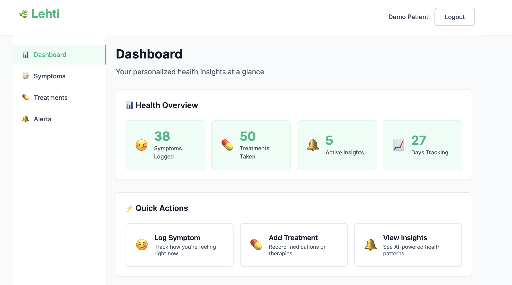
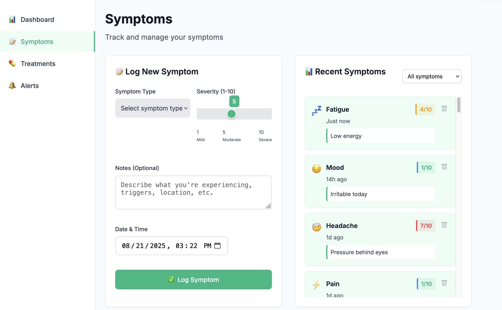
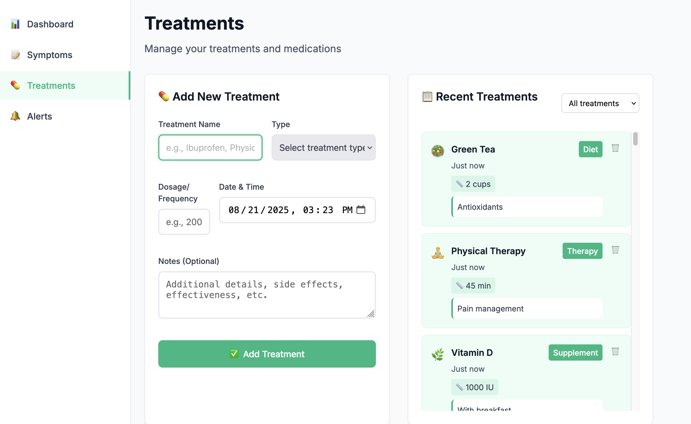
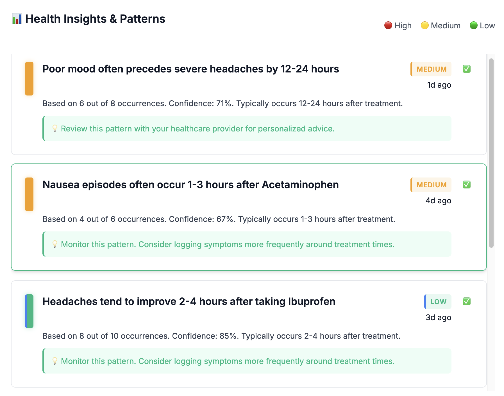

# Lehti - AI-Powered Personal Health Tracker

**Lehti** is an intelligent health tracking application that helps you discover patterns in your symptoms and treatments through AI-powered insights. Turn your health data into actionable knowledge.


## 📱 Screenshots

### Dashboard Overview
*Your personalized health insights at a glance - view your health stats, use quick action buttons to log symptoms or treatments, and follow the getting started guide for new users.*



### Symptom Tracking
*Select the type and severity of your symptom, add notes, and set the time - everything gets reflected in the recent symptoms tab with timestamps and color-coded severity indicators.*



### Treatment Management  
*Choose from different treatment types (medication, supplement, exercise, therapy, etc.) with proper emojis, enter dosage and notes - all treatments appear in your history with visual type indicators.*



### AI-Powered Insights
*View AI-generated health patterns with confidence levels, resolve alerts when you've acted on them, and filter between active and resolved insights to track your progress.*




## ✨ Features

### 🏥 **Health Tracking**
- **Symptom Logging**: Track 13 different symptom types with severity ratings (1-10)
- **Treatment Management**: Log medications, supplements, exercises, therapies, and lifestyle changes
- **Rich Data Types**: Notes, timestamps, dosages, and treatment categories

### 🤖 **AI-Powered Insights**
- **Pattern Recognition**: Discover correlations between treatments and symptom improvements
- **Predictive Alerts**: Get notified when symptoms might spike based on historical patterns  
- **Treatment Effectiveness**: See which interventions work best for you
- **Side Effect Detection**: Identify potential adverse reactions to treatments

### 📊 **Comprehensive Dashboard**
- **Health Overview**: Real-time stats on symptoms, treatments, and insights
- **Quick Actions**: One-click access to log symptoms or treatments
- **Getting Started Guide**: Step-by-step onboarding for new users
- **Progress Tracking**: Monitor your health journey over time

### 🔔 **Smart Alerts System**
- **Post-Treatment Analysis**: "Headaches improve 2-4 hours after Ibuprofen"
- **Symptom Spikes**: "Poor mood often precedes severe headaches"
- **Co-occurrence Patterns**: "Walking correlates with reduced pain levels"
- **Resolvable Insights**: Mark patterns as acknowledged and acted upon

## 🚀 Live Demo

Access the live application at: 

**Demo Credentials:**
- Email: `demo@folia.com`
- Password: `password123`

*The demo includes 30+ days of realistic health data with AI-generated insights.*

## 🛠️ Technology Stack

### Backend
- **Laravel 11** 
- **SQLite** 
- **JWT Authentication** 
- **Eloquent ORM** 

### Frontend
- **JavaScript** 
- **CSS** 
- **Responsive Design** 
- **RESTful API** 

### Infrastructure
- **Railway/Render** - Cloud deployment platform
- **Git** - Version control with GitHub
- **Composer** - PHP dependency management

## 📖 Installation & Setup

### Prerequisites
- PHP 8.2 or higher
- Composer
- SQLite
- Git

### Local Development

1. **Clone the repository**
   ```bash
   git clone https://github.com/yourusername/lehti.git
   cd lehti
   ```

2. **Install dependencies**
   ```bash
   composer install
   ```

3. **Environment setup**
   ```bash
   cp .env.example .env
   php artisan key:generate
   ```

4. **Database setup**
   ```bash
   touch database/database.sqlite
   php artisan migrate
   php artisan db:seed --class=HealthPatternsSeeder
   ```

5. **Start the development server**
   ```bash
   php artisan serve
   ```

6. **Access the application**
   - Open `http://localhost:8000` in your browser
   - Login with `demo@folia.com` / `password123`


### Environment Variables

```

### Database Schema

The application uses four main tables:
- `users` - User accounts and authentication
- `symptom_logs` - Individual symptom entries with severity and notes
- `treatments` - Treatment/intervention records with types and dosages  
- `alerts` - AI-generated health insights and patterns

## 🎯 Usage Guide

### 1. **Getting Started**
- Register a new account or use the demo credentials
- Follow the 3-step onboarding guide on the dashboard
- Start by logging your first symptom

### 2. **Logging Symptoms**
- Navigate to the "Symptoms" tab
- Select symptom type, rate severity (1-10), add notes
- Use the date/time picker for accurate timestamps
- Filter and search your symptom history

### 3. **Recording Treatments**
- Go to the "Treatments" tab  
- Choose treatment type (medication, supplement, exercise, etc.)
- Enter dosage, notes, and administration time
- View your treatment history with visual indicators

### 4. **Discovering Patterns**
- Check the "Alerts" tab for AI-generated insights
- Use filters to view resolved vs. unresolved patterns
- Click "Recompute Alerts" to generate new insights
- Mark insights as resolved when you've acted on them

### 5. **Dashboard Overview**
- Monitor your health stats at a glance
- Use quick action buttons for rapid data entry
- Track your progress over time

## 🤖 AI Pattern Recognition


## 🔐 Security Features

- **JWT Authentication** - Secure token-based auth
- **Input Validation** - Server-side validation for all inputs
- **SQL Injection Protection** - Eloquent ORM parameterized queries
- **XSS Protection** - Escaped output and CSP headers
- **Password Hashing** - Bcrypt with configurable rounds

## 📱 API Documentation

### Authentication Endpoints
```bash
POST /api/auth/register    # User registration
POST /api/auth/login       # User login  
POST /api/auth/logout      # User logout
GET  /api/auth/me          # Get current user
```

### Symptom Endpoints
```bash
GET    /api/symptom-logs   # List user's symptoms
POST   /api/symptom-logs   # Create new symptom log
PUT    /api/symptom-logs/{id}  # Update symptom log
DELETE /api/symptom-logs/{id}  # Delete symptom log
```

### Treatment Endpoints
```bash
GET    /api/treatments     # List user's treatments
POST   /api/treatments     # Create new treatment
PUT    /api/treatments/{id}    # Update treatment
DELETE /api/treatments/{id}    # Delete treatment
```

### Alert Endpoints
```bash
GET    /api/alerts         # List health insights
POST   /api/alerts/recompute   # Generate new patterns
POST   /api/alerts/{id}/resolve # Mark insight as resolved
```


